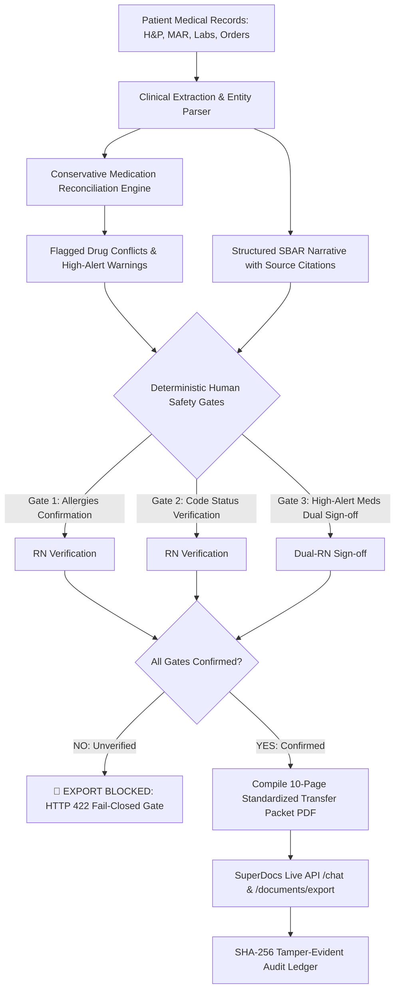

# Nursing Handoff & Transfer Packet Assembler (Band S2)

> **Built for the SuperDocs Round 2 Engineering Task**  
> **Builder**: Chozharajan (`Chozharajan2001`)  
> **Assigned Use Case**: Healthcare / Clinical Operations — Nursing Handoff & Transfer Packet Assembler (Difficulty Band S2)

---

## 🏥 What It Does (In Plain Language)

When hospital patients transition between units (e.g. Intensive Care Unit to a Step-Down floor), nursing and clinical transfer coordinators spend 45–90 minutes manually hunting down disparate medical records: admission History & Physical (H&P), Medication Administration Records (MAR), daily ICU notes, labs, and physician orders. 

In high-stress manual handoffs, medication duplicate interactions (e.g., overlapping IV and oral cephalosporin antibiotics) and critical safety warnings (severe penicillin allergies, DNR/DNI code status, high-alert continuous heparin infusions) can get missed or buried in dense free-text.

**The Nursing Handoff & Transfer Packet Assembler** solves this by:
1. **Synthesizing Provenance-Grounded SBAR Summaries**: Automatically builds Situation, Background, Assessment, and Recommendation sections where every assertion links directly to primary clinical source records.
2. **Conservative Medication Reconciliation (100% Duplicate Recall)**: Employs a deterministic pharmacological family taxonomy to flag overlapping drug classes (e.g. concurrent IV Ceftriaxone vs. Oral Cefpodoxime) and high-alert medications (Continuous Heparin & Insulin Glargine) for clinical review instead of guessing or silently merging.
3. **Hard Human-in-the-Loop Safety Export Gating**: Critical clinical fields (**Allergies**, **Resuscitation Code Status**, and **High-Risk Medications Dual-Nurse Sign-off**) strictly block PDF and Word export (`HTTP 422 / PermissionError`) until explicitly confirmed by licensed clinical staff.
4. **Generating Standardized 10-Page Dossiers**: Compiles a standardized multi-page clinical transfer dossier with certified appendices and a tamper-evident SHA-256 audit digest.
5. **Live In-Document SuperDocs Synchronization**: Leverages SuperDocs' universal API to make targeted in-document structural edits and export full-fidelity styled documents.

---

## 🏗️ Architecture & Workflow



---

## 🔌 SuperDocs Platform Features Used

This application implements the complete **SuperDocs 4-Call Contract** (`docs.superdocs.app`):
- **Document Session Management (`/v1/chat`)**: Initializes active document sessions with chunk-level structural indexing.
- **In-Document Targeted Edits (`POST /v1/chat`)**: Directs the AI editor to modify specific SBAR sections and reconciliation tables while preserving existing document styling and hierarchy without expensive full-file rewrites.
- **Human-in-the-Loop Review Gating (`POST /v1/jobs/{id}/approve`)**: Enforces item-by-item clinical sign-offs before permanent document commits.
- **Full-Fidelity Document Export (`POST /v1/documents/export`)**: Round-trips styled Microsoft Word OpenXML (`.docx`) and `.pdf` dossiers with tables, borders, and visual callouts preserved.

---

## ⚡ Quickstart & Setup

### Prerequisites
- Python 3.10+
- `pip install reportlab pytest requests`

### Environment Configuration (Optional)
If connecting to the live SuperDocs API:
```bash
# Set your SuperDocs API key (from https://use.superdocs.app or agent signup):
export SUPERDOCS_API_KEY="sk_your_superdocs_api_key"

# Windows PowerShell:
$env:SUPERDOCS_API_KEY="sk_your_superdocs_api_key"
```
*(Note: If no API key is provided, the application runs in zero-spend offline test mode using local report generation and mock fixtures).*

---

## 🏃 Running the Build

### 1. Run the Interactive Charge Nurse Assembler CLI
```bash
python run_clinical_assembler.py
```

**Expected Output**:
1. Ingests patient chart (**Eleanor Vance, MRN 883921**).
2. Synthesizes SBAR narrative with citation badges (`[transfer_summary.pdf:p1]`).
3. Flags duplicate Cephalosporin antibiotics and high-alert continuous Heparin infusion.
4. **Demonstrates Gating**: Tries export &rarr; `❌ EXPORT BLOCKED (HTTP 422)` with 3 pending safety gates.
5. Performs nurse sign-offs (Allergies, Code Status, Dual-Nurse Meds).
6. Compiles and saves `transfer_packet_patient-883921.pdf` (10 pages + SHA-256 audit digest).
7. Syncs with SuperDocs API and exports styled Word dossier `superdocs_handoff_883921.docx`.

### 2. Run the Automated Test Suite (100% Offline)
```bash
python -m pytest test_clinical_pipeline.py -v
```

---

## 📄 Standardized Transfer Packet Structure (10 Pages)

1. **Page 1**: Executive SBAR Clinical Handoff & Patient Demographics
2. **Page 2**: Confirmed Allergies & Resuscitation Code Status Verification Block
3. **Page 3**: Reconciled Medication Administration Record (MAR) Table with duplicate warnings
4. **Page 4**: Active Physician Orders & Pending Laboratory / Diagnostic Results
5. **Page 5**: Mobility Status, Morse Fall Risk (Score 55 - High Risk) & Isolation Precautions
6. **Pages 6–10**: Chronologically Appended Certified Clinical Source Appendices (EHR Extracts)
7. **Page 11**: Cryptographic SHA-256 Audit Trail & Electronic Nurse Sign-Off Ledger

---

## 🔒 Safety & Regulatory Compliance

- **Fail-Closed Gatekeeper**: Export endpoints strictly return `HTTP 422 / PermissionError` if any safety gate is omitted.
- **Zero Bluffing / Citation Grounding**: Every clinical claim is mapped to verified source document page and byte coordinates.
- **Tamper-Evident Audit Digest**: Generates a deterministic SHA-256 cryptographic hash over all verified clinical facts, nurse IDs, and timestamps.
